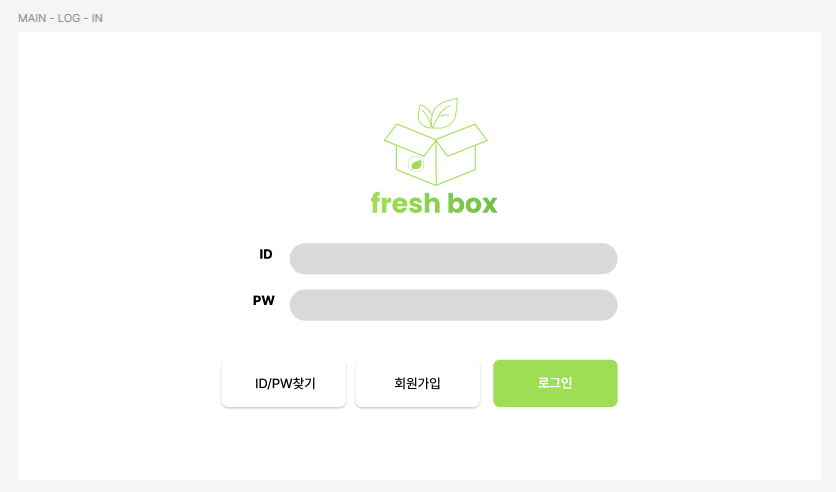
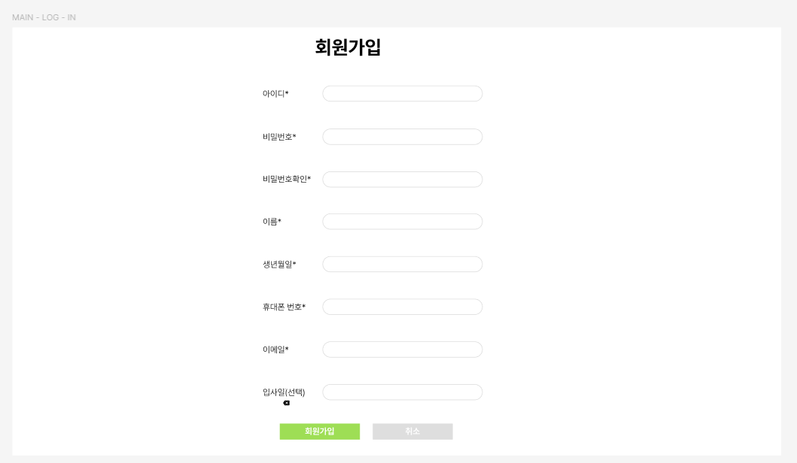
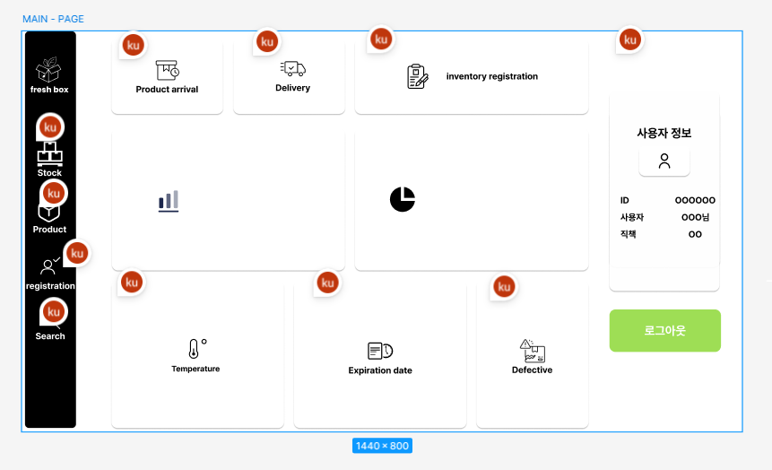
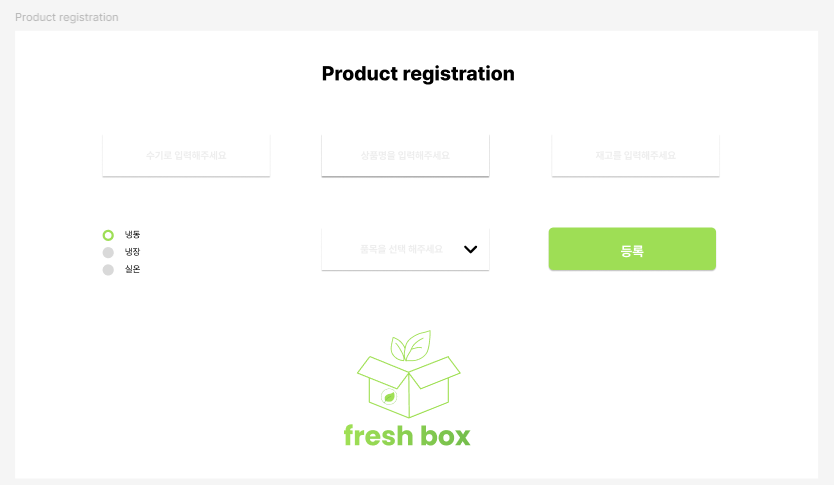

# 📦 FreshBox
> **공장의 자동화를 위한 식품 유통 관리 및 사원 관리 시스템**

<br />  

## 🛠️ 개발 스택

- **언어:** C#, XAML
  
- **프레임워크:** .NET WPF
- **디자인 패턴:** MVVM 패턴
- **데이터베이스:** MySQL
- **버전 관리:** Git, GitFlow 브랜치 전략
- **툴:** Visual Studio, MySQL Workbench
- **라이브러리:**
  - CommunityToolkit.Mvvm
    - MVVM 패턴 구현을 지원하는 라이브러리
  - BCrypt.Net-Next (v4.0.3)
    - 비밀번호 해싱 라이브러리로, 안전한 암호 저장과 인증에 사용(BCrypt 알고리즘을 기반)
  - LiveChartsCore.SkiaSharpView.WPF
    - WPF 환경에서 고성능 차트 렌더링을 지원하는 라이브러리
  - MaterialDesignColors
    - Material Design 컬러 팔레트를 제공하여 UI 디자인 시 일관된 색상 사용에 도움
  - MaterialDesignThemes
    - Material Design 스타일의 WPF 테마 및 컨트롤 세트를 제공하여 깔끔하고 현대적인 UI 구현에 도움
  - Microsoft.Xaml.Behaviors.Wpf
    - XAML에서 행동(Behavior)과 트리거(Trigger)를 사용할 수 있게 하는 라이브러리(MVVM 패턴에서 UI와 로직 분리에 유용)
  - MySql.Data
    - MySQL 데이터베이스와 .NET 애플리케이션 간 연결 및 조작을 지원하는 공식 라이브러리
  - System.Configuration.ConfigurationManager
    - 앱 설정 파일(App.config, Web.config)을 읽고 쓰는 데 사용

<br />  

## ❔ 개발 동기 (Why?)

1. 출퇴근 기록의 불편함 개선  
2. 물류에 필요한 자동화 관리 (사용자의 편리성)  
3. 스마트팩토리 관련 프로젝트 경험을 위해  

<br />

## ❔ 프로젝트 목적 (What?)

1. 재고 관리를 좀 더 편하게 하고  
2. 출퇴근 관리를 용이하게 하기 위해  

<br />

## ❔ 주요 기능 (How?)

1. 회원 가입 → 사원과 관리자를 분리  
2. 상품 등록  
3. 사용자 편의성을 고려한 편리한 UX/UI  
4. 입고 정보 관리  

<br />

## 🎯 타겟층
쇼핑몰, 유통회사 등에서 회원 및 재고 관리를 담당하는 공장주, 관리자, 사원 등 실무자  

<br />  

## 👥 팀원  

| 서예경 (리더)                          | 최마리                                                                | 박현승                                                                |
|:-------------------------------------:|:---------------------------------------------------------------------:|:---------------------------------------------------------------------:|
|  |                                   |                          |
| [@Seo-Yegyeong](https://github.com/Seo-Yegyeong) | [@ChoiMari](https://github.com/ChoiMari)                        | [@hyuns54](https://github.com/hyuns54)                    |

<br />  

## 🔹 담당 업무

### 👨🏻‍💻 박현승
- **[Front-End]**<br>

  - **UI 개발 전담** <br>
    `WPF` 기반 `XAML` 화면 설계 및 사용자 인터페이스 구현을 맡아, 전반적인 시각 요소와 사용자 경험을 책임짐.<br>

  - **화면 UI 구현**
    - 로그인 화면
    - 회원가입 화면
    - 메인 화면
    - 상품 등록 화면
    - 상품 입고 화면

  - **Front-End 작업에 사용된 이미지 및 아이콘 리소스 관리**<br>
    - 파비콘, 각종 아이콘, 로고 등 UI 구성에 필요한 시각적 요소의 삽입과 관리 담당

<br /> 

### 👩🏻‍💻 서예경
- **[Back-End]**
  - **상품 등록 기능 구현**
    - 상품 정보를 입력받아 데이터베이스에 저장하는 기능
  - **입고 처리 기능 구현**
    - 입고 시 상태를 관리하는 로직을 구현
  - **DB 연결 문자열 보안 관리 (`App.config`)**
    - 민감한 데이터베이스 연결 문자열을 `App.config`를 활용해 관리하고 외부 노출을 방지
  - **Enum 값 바인딩 관리 (`EnumConverter.cs`)**
    - 카테고리 등 Enum 값을 UI에 바인딩할 수 있도록 `EnumConverter` 클래스를 구현

- **[Database]**
  - **테이블 구조 설계 및 확장**
    - `my_order`, `outbound_request` 테이블을 새롭게 추가 설계하고,<br>기존 테이블과의 관계를 고려해 기본 키(Primary Key) 및 외래 키(Foreign Key)를 설정
  - **기존 테이블 정제 작업**
    - `product` 테이블의 6개 컬럼, `warehouse` 테이블의 2개 컬럼을 정제
  - **주석 추가**
    -  `product` 테이블 생성 SQL에 `COMMENT` 문을 추가하여 각 컬럼의 의미를 명시
  - **샘플/더미 데이터 작성 및 삽입**
    - 테스트를 위한 샘플 데이터를 직접 구성하고, 이를 데이터베이스에 삽입하는 `INSERT` 문을 작성
  - **SQL 반영 작업**
    - 추가 설계한 테이블에 대한 DDL SQL문 작성 및 자신의 개발 작업에 따른 일부 테이블 생성 SQL 문을 수정하고 프로젝트에 반영

<br /> 

### 👩🏻‍💻 최마리
- **[Front-End]**
  - 출퇴근 관련 화면(UI) 구성 및 인터랙션 로직 담당
    - **(사원/관리자용)** 출퇴근 메뉴 및 기능 페이지 구현
    - 사용자 권한에 따라 버튼 및 기능 노출 제어
    - 출퇴근 체크 및 기록 확인 기능 UI 설계
    - **(관리자용)** 출퇴근 기준 시간 설정 및 회사 휴일 등록 기능 구현

- **[Back-End] 사용자 인증 및 전역 세션 관리**
  - 로그인 / 로그아웃 / 회원가입 기능 구현
    - 사용자 권한(사원/관리자) 분리 및 세션 기반 로그인 관리 (`LoginSession.cs`)
    - 회원가입 시 입력값 검증(중복 검사, 유효성 검사) 및 비밀번호 암호화 처리(`BCrypt.Net`)
  - 로그인 후 사용자 정보 메인 페이지 출력
  - **DB 연동 클래스** `MysqlDatabaseManager.cs` 설계 및 구현

  - **[Navigation] 화면 전환 처리**
    - `INavigationService` 인터페이스 정의 및 화면 이동 로직 추상화
    - 실제 화면 전환을 담당하는 `ViewNavigationService` 구현

- **[Database]**
  - 프로젝트 전체 데이터베이스 구조 설계 및 정규화 작업 수행
    - 총 **10개 테이블** 설계 및 불필요 테이블(불량품 기록 등) 제거
    - 테이블 간 관계(PK/FK) 설정 및 **SQL 기반 스키마 전체 작성**
  - 데이터 흐름 정의
  - 추가 테이블 설계 및 쿼리 작성:
    - `work_time_settings`, `work_log_edit_requests`, `company_holidays`, `allowed_wifi`

<br />

## 🔸 기타 역할 분담

| 이름    | 역할 및 담당 분야                             |
| ------- | -------------------------------------------- |
| 박현승  | 디자인(로고·와이어프레임), 화면 설계, 발표|
| 서예경  | 리더, 프로젝트 생성 및 버전 관리, 회고록 관리, 발표 자료 PPT |
| 최마리  | 산출물 문서 작성 및 관리<br>(Notion, README.md, 일정 정리, 요구 사항 정의서 등)|

<br />  

## 🎨 UI 설계

[화면 설계서 - Notion 링크](https://www.notion.so/20c9879dac8681378f28e48e6a7346c7)  

&nbsp;&nbsp;&nbsp;&nbsp;&nbsp;&nbsp;&nbsp;&nbsp;&nbsp;&nbsp;&nbsp;&nbsp;&nbsp;&nbsp;&nbsp;&nbsp;&nbsp;&nbsp;<br />
&nbsp;&nbsp;<br />
&nbsp;&nbsp;<br />

<br />

## 🗂️ 폴더 구조 (CommunityToolkit.Mvvm 라이브러리 적용)

```jsx
FreshBox/
├── Assets/
├── Converter/
├── Database/
├── DTOs/
├── Enums/
├── Interfaces/
├── Models/
├── Repository/
├── Services/
├── ViewModels/
├── Views/
└── Dependencies/
```

<br />

## 📘 주요 기능 상세 설명
### 1. 회원 관리

#### 1-1. 회원 가입
- **중복 검사**  
  - 검사 대상: 아이디(username), 휴대폰번호(phone), 이메일(email)  
  - MySQL DB에서 `SELECT EXISTS` 쿼리로 중복 여부 확인  
  - 쿼리 예시:  
    ```sql
    SELECT EXISTS (SELECT 1 FROM member WHERE username = @username);
    SELECT EXISTS (SELECT 1 FROM member WHERE phone = @phone);
    SELECT EXISTS (SELECT 1 FROM member WHERE email = @email);
    ```  
  - 중복 시 UI에서 즉시 알림

- **유효성 검사**  
  - `SignUpViewModel` 클래스에서 구현 (ObservableObject 상속)  
  - 텍스트박스와 바인딩하여 입력값 변경 시 실시간 검사  
  - 주요 검사 내용:  
    - 아이디: 6~12자 영문/숫자, 공백 불가, 중복 검사  
    - 비밀번호: 10~20자, 2가지 이상 문자 조합 필수, 확인과 일치 검사  
    - 이름: 한글/영문 1~10자, 공백 불가  
    - 필요시 자동 자름 및 오류 메시지 출력

- **비밀번호 암호화**  
  - 평문 저장 금지  
  - SHA-256, BCrypt 등 해시 알고리즘 적용 권장

- **DB INSERT**  
  - 모든 검사 통과 후 회원 정보 DB에 삽입  
  - 정상 처리 시 INSERT 쿼리 실행

<br />

### 2. 상품 관리

- **DB 데이터 조회 및 UI 바인딩**  
  - `ProductRepository.GetAllProducts()` 메서드로 MySQL에서 상품 목록 SELECT  
  - 조회된 상품 리스트를 UI에 바인딩하여 화면에 출력

- **상품 등록 (INSERT)**  
  - 등록 버튼 클릭 시 `ProductRepository.InsertProduct(Product product)` 호출  
  - 입력한 상품 정보를 파라미터로 받아 DB에 INSERT 쿼리 실행  
  - INSERT 쿼리 예:  
    ```sql
    INSERT INTO product (product_name, category_id, barcode, stock, storage_temp, warehouse_id)
    VALUES (@ProductName, @CategoryId, @Barcode, 0, @StorageTemp, @WarehouseId);
    ```
  - 성공 시 1 반환, 실패 시 0 반환

- **예외 처리 및 DB 연결 관리**  
  - 쿼리 실행 중 예외 발생 시 콘솔에 에러 메시지 출력  
  - 모든 DB 작업 후 커넥션은 반드시 닫음  

- **기타 기능**  
  - 상품 수정, 삭제, 이름으로 상품 조회 등 메서드 포함  
  - 중복 상품명 체크 메서드로 상품명 중복 방지 가능

<br />

### 3. 주문 및 입고 관리

#### 3-1. 주문 내역 조회 및 관리
- **주문 내역 조회**  
  - MySQL DB의 `my_order` 테이블에서 주문 데이터 조회  
  - 주문 ID, 주문 날짜, 상품 ID, 수량 등 주요 정보 포함  
  - 조회 결과를 UI에 바인딩하여 리스트 형태로 표시

- **주문 내역 수정 (UpdateMyOrder)**  
  - 주문 날짜, 상품 ID, 수량 등의 정보를 수정 가능  
  - SQL 파라미터 바인딩으로 SQL 인젝션 방지  
  - 수정 성공 시 DB에 업데이트 쿼리 실행

- **주문 내역 삭제 (DeleteMyOrder)**  
  - 주문 ID를 기준으로 해당 주문을 삭제  
  - 삭제 시 연관된 입고 내역 등 데이터 무결성 고려 필요

- **상품명으로 상품 ID 조회 (GetProductIdByName)**  
  - 입력된 상품명으로 DB에서 상품 ID를 조회  
  - 실패 시 -1 반환, 오류 처리 포함

#### 3-2. 입고 처리 및 입고 로그 관리
- **입고 로그 삽입 (InsertInboundLog)**  
  - 입고 발생 시 현재 시간, 주문 ID, 상품 ID, 수량 정보를 `INBOUND_LOG` 테이블에 기록  
  - SQL 파라미터 사용으로 보안 강화 (구현 중)  
  - DB 커넥션 관리 및 예외 처리 포함

- **입고 로그 조회 및 UI 바인딩**  
  - `InboundLogViewModel`에서 입고 로그 컬렉션 관리  
  - UI와 데이터 바인딩을 통해 실시간 입고 내역 확인 가능

- **DB 연결 관리**  
  - `MysqlDatabaseManager` 싱글톤으로 DB 연결 획득 및 종료  
  - 모든 DB 작업 후 연결을 반드시 닫아 자원 누수 방지

- **예외 처리**  
  - 쿼리 실행 중 발생하는 예외는 콘솔에 상세 메시지 출력  
 
<br />  

### 4. UI 및 화면 전환(네비게이션)
#### 4-1. NavigationService 클래스 구현 및 싱글턴 패턴 적용
- WPF 기본 `NavigationService`가 UserControl 전환을 지원하지 않아, 커스텀 `INavigationService` 인터페이스 정의   
- `INavigationService` 인터페이스 구현  
  - `NavigateTo(string viewName)`: 지정 뷰로 전환  
  - 이전 뷰 이름을 스택에 저장해 `GoBack()` 호출 시 복귀   
  - 싱글턴 패턴 적용으로 애플리케이션 전역에서 단일 인스턴스 공유
- 메인 화면 내 동적 페이지 전환 (단일 MainWindow 기반)  
- **초기화**  
  - 메인 윈도우 코드비하인드에 `<ContentControl x:Name="ScreenHolderContentControl"/>` 추가  
  - 앱 시작 시 `ViewNavigationService.Initialize(ScreenHolderContentControl)` 호출  
- **뷰 등록**  
  - `RegisterView(string viewName, UserControl view)`로 뷰 이름과 인스턴스를 내부 딕셔너리에 등록  
- **화면 전환**  
  - 등록된 뷰 이름으로 `NavigateTo()` 호출 → `ContentControl.Content` 속성 변경  
  - 이전 뷰 이름은 스택에 저장 → `GoBack()` 호출 시 팝하여 복귀  
- **예외 처리**  
  - 초기화 미실행 또는 등록되지 않은 뷰 전환 시 예외 발생

#### 4-2. 로그인 사용자 정보 메인 화면 출력  
- **전역 로그인 세션 관리**
  - `LoginSession` 싱글턴 클래스 사용
  - 로그인 성공 시 사용자 ID, 이름 등 최소 정보 저장
  - 이후 `LoadAdditionalInfo()`를 통해 권한 및 실명 추가 조회

- **ViewModel 연동 (MVVM 패턴 기반)**
  - `MainVisualViewModel`에서 `LoadUserInfo()` 호출
  - `LoginSession`에 저장된 로그인 정보를 ViewModel에 로딩
  - 아래 3가지 바인딩 프로퍼티로 UI에 정보 출력
    - `LoginUsername` (사용자 ID)
    - `LoginMemberName` (이름)
    - `LoginRole` (권한)

- **실시간 바인딩 처리**
  - ViewModel은 `INotifyPropertyChanged`를 통해 값 변경 시 View에 자동 반영
  - 사용자가 로그인할 때마다 메인 화면에 즉시 정보 갱신됨

<br />  

## 📸 스크린샷

<br />  

## 🫱🏻‍🫲🏻 협업 방식

### GitFlow 브랜치 전략 및 PR 활용
```
💡main ← 최종 배포용, 항상 안정적
└─ develop ← 개발 통합본
├─ feature/기능명 ← 기능별 작업
├─ fix/버그명 ← 버그 수정
├─ hotfix/긴급패치 ← 운영 중 긴급 패치
└─ release/버전명 ← 배포 준비
```

<br />  

## ❗ 트러블 슈팅 및 오류 해결

| 이름   | 작업 내용 및 문제점  | 해결 방법   |
| -------- | ---------------------------------------- | --------------------------------------------|
| 박현승  | Main Page View UI 설계 후 XAML 속성 지식 부족| 태그 속성 학습 및 코드 정리,<br>코너 라운드 속성 등 문제 해결 |
| 서예경  | RelayCommand 참조 실패,<br>DataContext 미설정 에러| XAML 및 코드비하인드에 ViewModel 참조 선언 추가 |
| 최마리  | PasswordBox MVVM 바인딩 문제<br>(비밀번호 보안 이슈)| 코드비하인드에서 ViewModel로 직접 값 전달,<br>AttachedProperty 시도 후 포기 |

<br />  

## 💬 결과 및 느낀점

| 이름   | 어려웠던 점 및 해결 방법          | 개선점 및 느낀점        |
| -------- | ------------------------------------ | ------------------------------------------ |
| 박현승  | 기본 코딩 개념 부족, 직접 구현 미흡 <br>→ 지속적 학습 필요| 단기간 구현의 한계 경험,<br>팀원 간 소통과 체력 분배 중요성 체감|
| 서예경  | MySQL 초기 연결 문제<br>→ 재설치 및 재연결로 해결<br>MVVM 구조화 어려움<br>→ 예시 코드 참고하여 공부<br>DataContext 참조 문제<br>→ 클래스 접근자 변경 및 클린 솔루션 시도로 해결| 기능 집중 위한 시간 확보 필요,<br>팀장으로서 역할 및 목표 설정 중요성 인지|
| 최마리  | MySQL 연동 초기 시간 소모,<br>동기 메서드 위주 구현이 아쉬움 <br>→ 코드 구조가 잡힌 이후부터는 순조롭게 진행| 의존성 주입 적용 필요, 비동기 메서드로 변경,<br>개발 기간 부족 아쉬움|

<br />  

## ✉️ 문의 및 연락처

- 팀 리더: 서예경  
- 이메일: seoyekyung@example.com

  
<br />  

